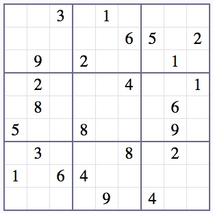

# sudokujs

sudokujs is a javascript library to **solve** and **generate random** sudoku puzzle

[Demo online](https://nghiatrx.github.io/test)

## Installation

Add the below code into your HTML file

```HTML
<script src="sudoku.min.js"></script> 
```

## Usage

### Solve



You must convert to array, example: 

```javascript
var array = [0, 0, 3, 0, 1, 0, 0, 0, 0, 0, 0, 0, 0, 0, 6, 5, 0, 2, 0, 9, 0, 2, 0, 0, 0, 1, 0, 0, 2, 0, 0, 0, 4, 0, 0, 1, 0, 8, 0, 0, 0, 0, 0, 6, 0, 5, 0, 0, 8, 0, 0, 0, 9, 0, 0, 3, 0, 0, 0, 8, 0, 2, 0, 1, 0, 6, 4, 0, 0, 0, 0, 0, 0, 0, 0, 0, 9, 0, 4, 0, 0];
```

```javascript
sudokujs.solve(array, function(result){
    // callback for done
    console.log(result);
}, function() {
    // callback for fail
    console.log('Input is not valid');
});
```

result will be look like:

```javascript
result = [2, 6, 3, 5, 1, 7, 9, 4, 8, 7, 1, 8, 9, 4, 6, 5, 3, 2, 4, 9, 5, 2, 8, 3, 6, 1, 7, 6, 2, 9, 7, 3, 4, 8, 5, 1, 3, 8, 7, 1, 5, 9, 2, 6, 4, 5, 4, 1, 8, 6, 2, 7, 9, 3, 9, 3, 4, 6, 7, 8, 1, 2, 5, 1, 7, 6, 4, 2, 5, 3, 8, 9, 8, 5, 2, 3, 9, 1, 4, 7, 6]
```

### Generate random sudoku puzzle

```javascript
sudokujs.generate(function(result) {
    console.log(result);
});
```

